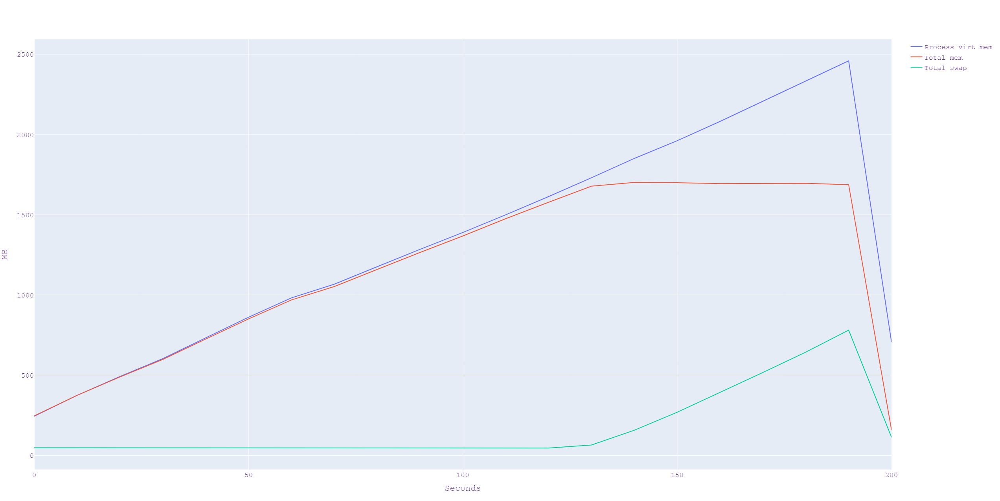
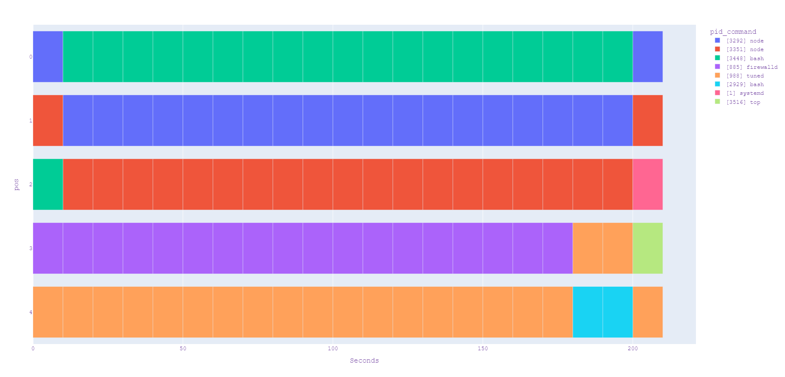
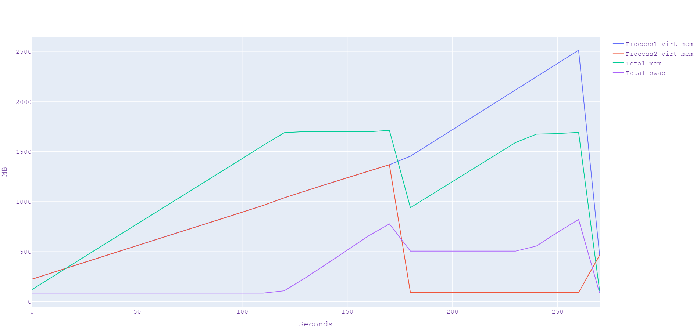
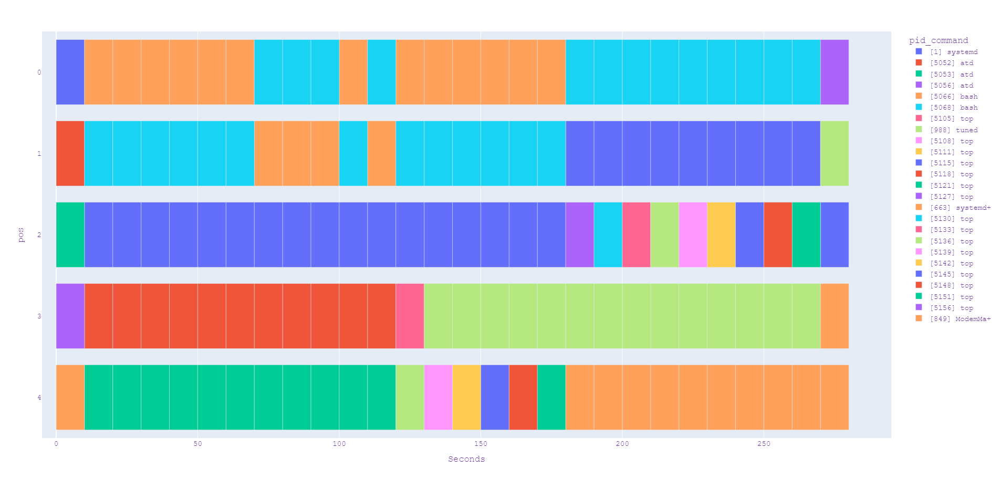

# Отчёт 

|                                                                          |        |
|-------------------------------------------------------------------------:|-------:|
|                                          Общий объём оперативной памяти  |  1.77G |
|                                                   Объём раздела подкачки |  820MB |
|                                       Размер страницы виртуальной памяти |   4096 |
|               Объём свободного физической памяти в ненагруженной системе | 1400MB |
| Объём свободного пространства в разделе подкачки в ненагруженной система |  765MB |

## Эксперимент 1
### Измерения
Основной скрипт `mem.sh` был запущен в ненагруженной системе и работал до аварийной остановки. Для снятия показаний использовался вспомогательный скрипт `scan.sh`, который раз в 10 секунд обращался к `top`.
#### Параметры системы

#### Верхние 5 процессов

#### `dmesg` 
```log
[ 2558.992008] Out of memory: Killed process 3448 (bash) total-vm:2545188kB, anon-rss:1591404kB, file-rss:0kB, shmem-rss:0kB, UID:0 pgtables:4612kB oom_score_adj:0
[ 2559.124810] oom_reaper: reaped process 3448 (bash), now anon-rss:0kB, file-rss:0kB, shmem-rss:0kB
```
#### `report.log`
```
29000000
```
### Вывод
Из графика видно, что когда память в системе закончилась, но процесс выделял её дальше, то часть его адресного пространства была перенаправлены в `swap`. Когда процесс попытался аллоцировать память, но система не смогла этого сделать, то процесс был убит.  

## Эксперимент 2
## Измерения
Скрипты `mem.bash` и `mem2.bash` были запущены при помощи `at`. Измерения производились аналогично эксперименту 1. 
#### Параметры системы

#### Верхние 5 процессов

#### `dmesg`
```log
Process2:

[10644.351588] Out of memory: Killed process 5066 (bash) total-vm:1403916kB, anon-rss:858764kB, file-rss:0kB, shmem-rss:0kB, UID:0 pgtables:2392kB oom_score_adj:0
[10644.414251] oom_reaper: reaped process 5066 (bash), now anon-rss:0kB, file-rss:0kB, shmem-rss:0kB
[10735.401061] tuned invoked oom-killer: gfp_mask=0x6200ca(GFP_HIGHUSER_MOVABLE), order=0, ...oom_score_adj=0

Process1:

[10735.451976] Out of memory: Killed process 5068 (bash) total-vm:2559840kB, anon-rss:1586492kB, file-rss:0kB, shmem-rss:0kB, UID:0 pgtables:4648kB oom_score_adj:0
[10735.563497] oom_reaper: reaped process 5068 (bash), now anon-rss:0kB, file-rss:0kB, shmem-rss:0kB
```
#### `report.log`
```
29000000
```
#### `report2.log`
```
15000000
```
### Вывод
Видно, что в начале скрипты ведут себя идентично и оба аллоцируют память. Как и в прошлом эксперименте, когда память закончилась то адресное пространство обоих скриптов было частично определено в `swap`. Однако когда память закончилась, то один из процессов был убит как в прошлом эксперименте, а второй продолжил работу благодаря памяти, освободившейся после освобождения ресурсов убитого.
